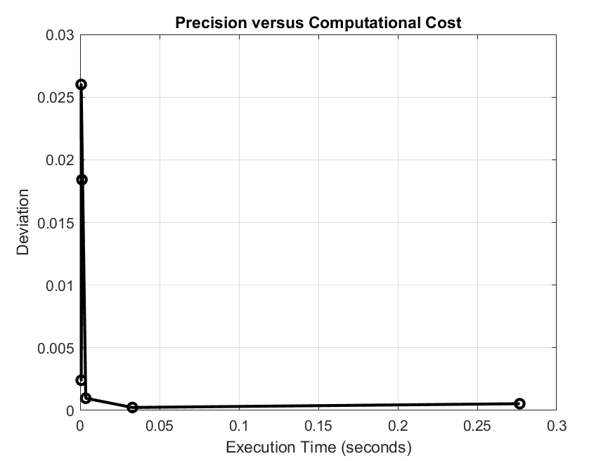

# Monte Carlo Estimation of π

This repository contains a MATLAB program that estimates the value of π using the **Monte Carlo method**. It uses the relationship between randomly chosen points in a unit square and the area of a quarter circle to approximate π. This method uses random sampling, and its accuracy increases as the number of points increases.

## Methodology

The Monte Carlo method estimates π by generating random points \((x, y)\) in a unit square \([0, 1] \times [0, 1]\) and determining how many fall inside a quarter circle of radius 1. The area of the quarter circle is \(\frac{\pi}{4}\), so the probability of a random point falling inside the circle is proportional to this area. The ratio of points inside the circle to the total number of points gives an estimate of \(\frac{\pi}{4}\), and multiplying this ratio by 4 gives an estimate of π.

### Key Steps in the Code:
1. **Generate Random Points**: Random \(x\) and \(y\) coordinates are generated in the unit square.
2. **Check Circle Condition**: The points that satisfy \(x^2 + y^2 \leq 1\) are counted as lying within the quarter circle.
3. **Estimate π**: The ratio of points inside the quarter circle to the total number of points is multiplied by 4 to estimate π.
4. **Execution Time**: The program tracks the execution time for different numbers of points.
5. **Plot Results**: The results are plotted to show how the estimation of π improves with more points and to analyze the trade-off between precision and computational cost.

## Files
- `monte_carlo_pi.m`: The MATLAB script that performs the Monte Carlo estimation of π, measures the execution time, and generates the plots.
- `README.md`: This file, which explains the project, methodology, and results.

## Usage
1. Clone the repository and open `monte_carlo_pi.m` in MATLAB.
2. Run the script. It will compute the estimated value of π for various numbers of random points and generate the following plots:
   - **Estimated value of π versus the number of points**: Compares the Monte Carlo estimation with the true value of π.
   - **Deviation of estimated π from the true value**: Shows how the precision of the estimation improves as the number of points increases.
   - **Execution time versus number of points**: Displays how computational cost increases with more points.
   - **Precision versus computational cost**: Illustrates the trade-off between precision (deviation from π) and computation time.

## Results

### 1. Monte Carlo Estimation of π
This plot shows the estimated value of π as the number of random points increases. The horizontal red line represents the true value of π. As the number of points increases, the estimate converges towards the true value.

### 2. Deviation of Estimated π from True Value
The deviation from the true value of π decreases as the number of points increases. The plot shows that using more points improves the accuracy of the estimation.

### 3. Execution Time versus Number of Points
As the number of random points increases, the computational cost also increases. This plot shows the execution time as a function of the number of points.

### 4. Precision versus Computational Cost
This plot highlights the trade-off between precision and computational cost. While more points provide better accuracy, they also require more computation time.

## Conclusion
The Monte Carlo method offers a simple and effective way to estimate the value of π. However, its precision improves slowly, meaning that a large number of points are needed to achieve a high level of accuracy. This comes at the cost of increased computation time. The plots generated by the MATLAB program visualize this trade-off and demonstrate how the accuracy improves with more points.