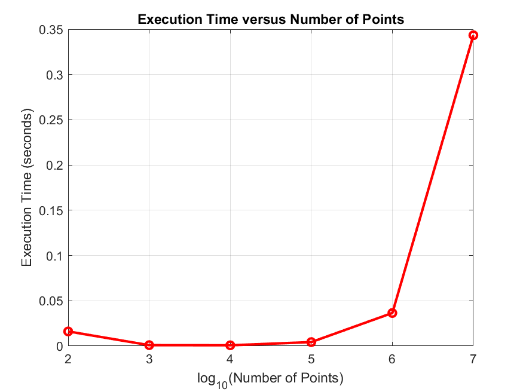
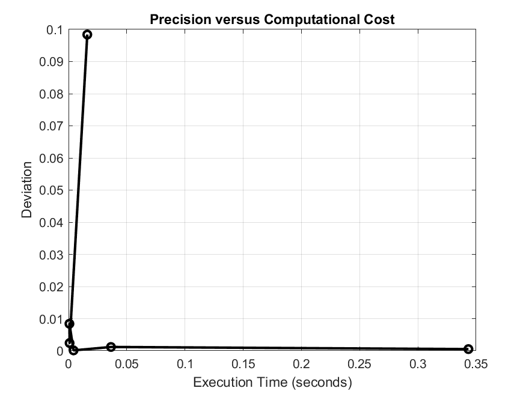
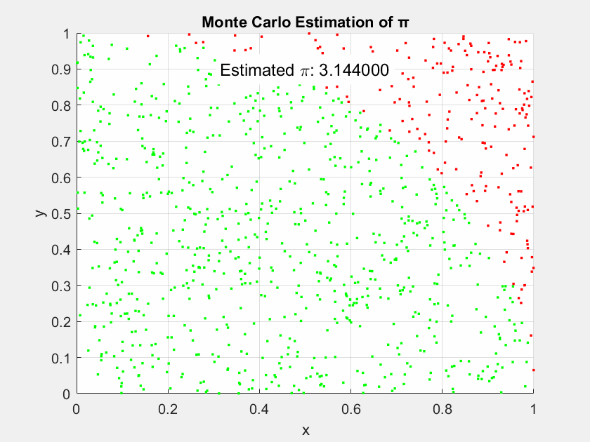

# Monte Carlo Estimation of π

This repository contains a MATLAB program that estimates the value of π using the **Monte Carlo method**. It uses the relationship between randomly chosen points in a unit square and the area of a quarter circle to approximate π. This method uses random sampling, and its accuracy increases as the number of points increases.

## Methodology

The Monte Carlo method estimates π by generating random points (x, y) in a unit square ([0, 1] × [0, 1]) and determining how many fall inside a quarter circle of radius 1. The area of the quarter circle is π/4, so the probability of a random point falling inside the circle is proportional to this area. The ratio of points inside the circle to the total number of points gives an estimate of π/4, and multiplying this ratio by 4 gives an estimate of π.

### Key Steps in the Code:
1. **Generate Random Points**: Random (x) and (y) coordinates are generated in the unit square.
2. **Check Circle Condition**: The points that satisfy (x^2 + y^2 <= 1) are counted as lying within the quarter circle.
3. **Estimate π**: The ratio of points inside the quarter circle to the total number of points is multiplied by 4 to estimate π.
4. **Execution Time**: The program tracks the execution time for different numbers of points.
5. **Plot Results**: The results are plotted to show how the estimation of π improves with more points and to analyze the trade-off between precision and computational cost.

## Adaptive Precision Estimation

The adaptive precision program uses a `while` loop to estimate π to a specified level of precision. The program does not rely on the true value of π but adapts based on the change in estimates.

### Key Steps in the Code:
1. **Precision Target**: The target precision is set to a specified level (e.g., 0.001 for 3 significant figures).
2. **While Loop**: The loop continues until the deviation between consecutive estimates is less than the target precision or until a maximum number of iterations is reached.
3. **Adaptive Sampling**: The number of points is incrementally increased to refine the estimate.
4. **Results**: The number of points used, the number of iterations, and the final deviation are recorded and displayed.

## Files
- `monte_carlo_pi.m`: The MATLAB script for fixed-point estimation of π, including execution time and precision plots.
- `monte_carlo_precision.m`: The MATLAB script for adaptive precision estimation of π using a `while` loop.
- `README.md`: This file, which explains the project, methodology, and results.

## Usage
1. Clone the repository and open the MATLAB scripts in MATLAB.
2. Run `monte_carlo_pi.m` to compute the estimated value of π for various numbers of random points and generate the following plots:
   - **Estimated value of π versus the number of points**: Compares the Monte Carlo estimation with the true value of π.
   - **Deviation of estimated π from the true value**: Shows how the precision of the estimation improves as the number of points increases.
   - **Execution time versus number of points**: Displays how computational cost increases with more points.
   - **Precision versus computational cost**: Illustrates the trade-off between precision (deviation from π) and computation time.

3. Run `monte_carlo_precision.m` to compute π to a specified precision. The script will:
   - Dynamically adjust the number of points based on the precision target.
   - Record the number of points, iterations, and final deviation.

4. Run the MATLAB function `estimate_pi_to_precision.m` with a GIF filename (for simulation). In the MATLAB command window:
```matlab
pi_value = estimate_pi_to_precision(1e-3, 'monte_carlo_simulation.gif');
```
   - Computes π to the specified precision.
   - Creates and saves an animated GIF showing the simulation process. 

## Results

### 1. Fixed-Point Estimation of π
This plot shows the estimated value of π as the number of random points increases. The horizontal red line represents the true value of π. As the number of points increases, the estimate converges towards the true value.


### 2. Deviation of Estimated π from True Value
The deviation from the true value of π decreases as the number of points increases. The plot shows that using more points improves the accuracy of the estimation.


### 3. Execution Time versus Number of Points
As the number of random points increases, the computational cost also increases. This plot shows the execution time as a function of the number of points.



### 4. Precision versus Computational Cost
This plot highlights the trade-off between precision and computational cost. While more points provide better accuracy, they also require more computation time.



### 5. Adaptive Precision Estimation
This plot shows the estimated value of π as the number of points increases to achieve the desired precision.


### 6. Graphical Display
This is a simulation of the random points as they are generated.


## Conclusion
The Monte Carlo method offers a simple and effective way to estimate the value of π. The fixed-point method provides a general estimation with increasing accuracy as more points are used. The adaptive precision method refines the estimation based on the desired precision level without relying on the true value of π, showing how the number of points and iterations affect precision and computational cost.